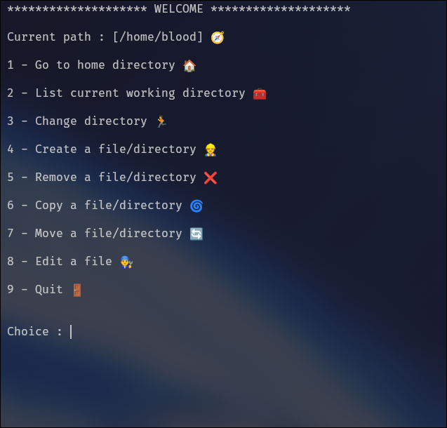

# Welcome to QuickFiles

### Simple terminal tool for easy file management without having to memorize any shell commands.


# Screenshot


# Installation

### Simply clone this repo to your desired directory, then run main.py found in src.
```bash
git clone --depth=1 https://github.com/Blood-Art/QuickFiles/ && cd QuickFiles && cd src && python3 main.py
```

# Usage

You can choose from the 9 options. just enter the number e.g: **3** and it will prompt you to enter any path to move to.
or you can just chain the path after the command, e.g: ```3 /home``` will move you to the home directory.
as for listing, removing, creating, copying, moving files or directories you can choose more than one file at the same time e.g: ```4 test1.txt test2.txt test3.txt``` will create 3 files or directories.
>[!NOTE]
> ```5 .``` will remove every file in the current directory.
> ```2 .``` will list every file in the current directory including hidden files.
